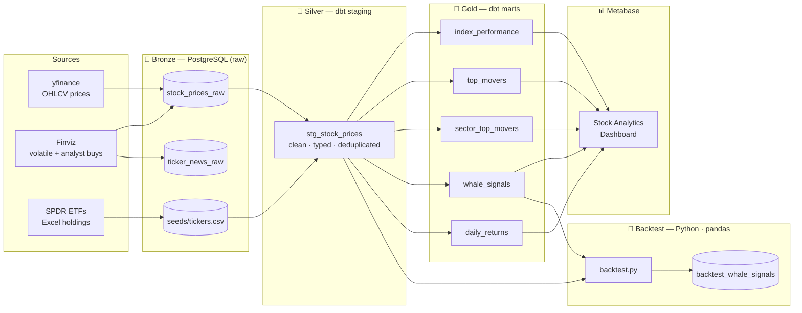
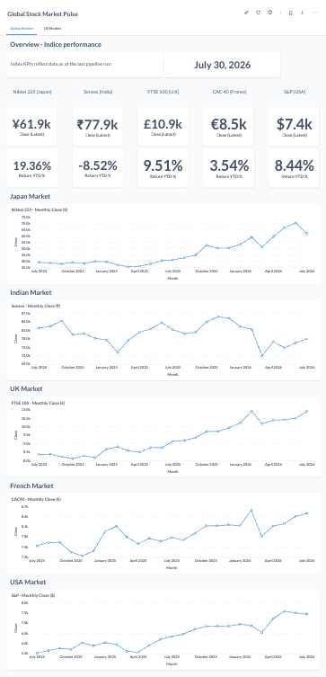
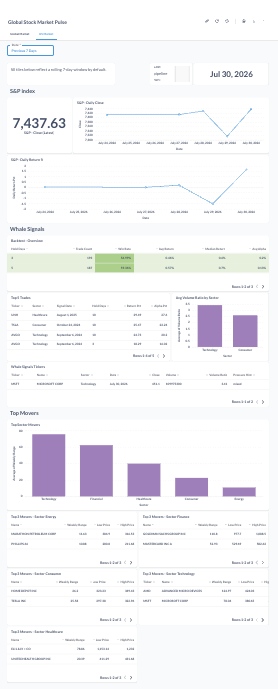

# Global Stock Market Pulse


**Signals tracked today:**
-0ea5e9)


## Why this project?

I've always been curious about how global markets move and interact — this project started as a way to explore that curiosity hands-on, while learning a real data pipeline stack (ingestion → warehouse → transformation → dashboard) end to end, rather than just reading about it.

## What this project does

A macro pulse on global stock markets — built to spot market-wide shifts quickly, from world index movements down to sector trends and US institutional activity signals.

The analysis works in three layers, each zooming in a bit further:

1. **Global indices** — daily performance of 5 major world indices, a starter set picked to cover the main economic regions rather than exhaustive world coverage (see [Global indices](#global-indices) below for the reasoning behind each one)
2. **Sector view** — weekly sector movers via SPDR ETFs *(currently US market only — more on this in [Ticker universe](#ticker-universe))*
3. **US deep dive — whale signals** — a volume-spike detector (`whale_signals`) that flags potential institutional trading activity on individual US stocks (large funds entering/exiting a position leave a footprint in volume), backtested against real price history

All three layers feed the same Metabase dashboard. The project is meant to grow: new macro signals or markets get added as their own layer, without changing the core architecture — see [Roadmap](#roadmap).

> Currently runs **locally** (PostgreSQL + Metabase on your own machine — see [Getting started](#getting-started)), and price history is limited to a **rolling 2-year window** to keep ingestion and storage light while the project is still growing. Both are deliberate scope choices for now, not limitations of the approach.

## Stack

```
yfinance + Finviz → PostgreSQL → dbt → Metabase
```

| Layer | Tool | Role |
|-------|------|------|
| Ingestion | Python · yfinance · finvizfinance · pandas | Multi-source: SPDR ETF holdings, Finviz volatile picks, analyst buys, global indices |
| Storage | PostgreSQL | Bronze layer (raw data) — `stock_prices_raw`, `ticker_news_raw` |
| Transformation | dbt | Silver (staging) + Gold (marts) — tested and documented |
| Visualization | Metabase | Interactive dashboard connected to PostgreSQL Gold layer — date filter, KPI cards, per-market trend charts |

## Architecture

Follows the **Medallion architecture** (Bronze / Silver / Gold):



- **Bronze** — raw tables loaded by `load_data.py`: `stock_prices_raw` (OHLCV) and `ticker_news_raw` (Finviz headlines)
- **Silver** — `stg_stock_prices` (cleaned, typed, filtered — one row per ticker per day)
- **Gold** — marts ready for Metabase queries:
  - `index_performance` — 1D / YTD / 2Y returns for 5 global indices
  - `top_movers` — top 5 most volatile stocks over the last 7 days (overall)
  - `sector_top_movers` — top 3 per sector by weekly price range
  - `whale_signals` — stocks with volume > 2.5× their 20-day rolling average
  - `daily_returns` — day-over-day return per ticker

## Dashboard

Interactive **Stock Analytics** dashboard built with Metabase, connected directly to the Gold layer. Two tabs — **Global Markets** (index KPIs, 1D/YTD/2Y returns) and **US Markets** (sector top movers, whale signals, top volatile stocks). Returns are computed close-to-close (point-in-time), not as an average of daily closes over the period — averaging would systematically understate or overstate the actual move depending on trend direction.

*Example of interpretation (one-time interpretation of that specific capture):



*- KPIs and trend charts shows the latest close and YTD return not a monthly average. 
As of July 30, 2026: Nikkei 225 leads the year (+19.36%), followed by FTSE 100 (+9.51%) and S&P 500 (+8.44%) — both near multi-year highs. 
CAC 40 is up modestly (+3.54%), having plateaued after two years of steady gains. Sensex is the outlier, down 8.52% YTD after a sharp pullback from its late-2025 peak, visible as the drop toward the end of its trend line.*



*- US Markets — all tiles on a rolling 7-day window. 
The backtest confirms the whale signal has a real, if modest, edge: positive alpha across all three holding periods (3/5/10 days), strongest at 10 days, on a robust sample (187–193 trades each). 
This week's two live signals — MSFT (Technology, 3.41× normal volume) and AMZN (Consumer, 2.58×) — both show a "mixed" pressure hint (Close Location Value near zero), meaning the volume spike doesn't clearly favor buyers or sellers on its own; *


> Runs **locally** for now 
To start it:

```bash
# One-time setup
brew install openjdk@21
mkdir -p ~/Documents/tools/metabase && cd ~/Documents/tools/metabase
curl -L https://downloads.metabase.com/v0.52.5/metabase.jar -o metabase.jar

# Every time you want the dashboard
java -jar metabase.jar
```

Accessible at **http://localhost:3000** once started.

Before opening, refresh the data so the dashboard reflects the stock market data:

```bash
python3 load_data.py   # re-ingest yfinance + Finviz + SPDR → PostgreSQL
dbt seed               # reload seeds/tickers.csv
dbt run                # rebuild index_performance, top_movers, sector_top_movers, whale_signals
```

[→ Open dashboard](http://localhost:3000/public/dashboard/0ad7bcd8-7d38-4638-b35c-7f33c3d2af31) *(localhost only, once Metabase is running)*

## Global indices

The 5 indices tracked in `index_performance` were picked to spread across the main regions driving global markets, not just the US:

| Index | Ticker | Region | Why it's tracked |
|-------|--------|--------|-------------------|
| S&P 500 | `^GSPC` | United States | World's largest economy, the most-watched global benchmark |
| CAC 40 | `^FCHI` | France / Eurozone | Eurozone exposure |
| FTSE 100 | `^FTSE` | United Kingdom | Major European market outside the Eurozone |
| Nikkei 225 | `^N225` | Japan | Developed Asia |
| Sensex | `^BSESN` | India | Fast-growing emerging Asia |

Together they give a quick read on US, Europe (both Eurozone and non-Eurozone), and Asia (developed and emerging) in one view.

The rule is one benchmark per region, not one per index worth watching — so notable names like the NASDAQ or other European markets are deliberately left out here, not overlooked.

## Ticker universe

Tickers are selected dynamically from three sources and combined at runtime:

| Source | Description | Scope | Count |
|--------|-------------|-------|-------|
| SPDR Sector ETFs | Top 5 holdings per sector (XLK, XLF, XLV, XLY, XLE) via SSGA daily Excel files | 🇺🇸 US market only | ~25 stocks |
| Finviz volatile | Most volatile S&P 500 + NASDAQ 100 stocks by absolute daily change | 🇺🇸 US market only | 5 stocks |
| Finviz analyst buys | S&P 500 stocks with Strong Buy consensus, sorted by volume | 🇺🇸 US market only | 5 stocks |
| Indices | 5 global indices — see [Global indices](#global-indices) above | 🌍 Global | 5 indices |

The sector view and the whale signal deep dive both run on this same US stock universe — extending them to other markets (e.g. CAC 40 or FTSE 100 constituents) is on the [Roadmap](#roadmap).

The static SPDR universe is stored in `seeds/tickers.csv` and auto-refreshed when older than 30 days. Finviz picks are fetched live at each pipeline run.

## Getting started

**Prerequisites:** Python 3.9+, PostgreSQL, dbt-core

```bash
# 1. Clone and install dependencies
git clone https://github.com/Neotopia/global-stock-market-pulse.git
cd global-stock-market-pulse
pip3 install yfinance pandas sqlalchemy psycopg2-binary python-dotenv \
             dbt-postgres requests openpyxl finvizfinance python-dateutil

# 2. Configure your database connection
cp .env.example .env
# Edit .env and set DATABASE_URL=postgresql://your_user@localhost:5432/your_db

# 3. Load raw data (rolling 2-year window)
python3 load_data.py

# 4. Run dbt transformations
dbt deps        # install dbt_utils package
dbt seed        # load seeds/tickers.csv into PostgreSQL
dbt run
dbt test
```

## Project structure

```
global-stock-market-pulse/
├── load_data.py          # Ingestion: SPDR + Finviz + yfinance → PostgreSQL
├── backtest.py           # Whale signal backtesting — pure pandas, saves to PostgreSQL
├── .env.example          # Database connection template (never commit .env)
├── dbt_project.yml       # dbt config (materializations, schemas)
├── packages.yml          # dbt package dependencies (dbt_utils)
├── models/
│   ├── staging/          # Silver layer — stg_stock_prices (clean, cast, filter)
│   └── marts/            # Gold layer — index_performance, top_movers, sector_top_movers, whale_signals, daily_returns
├── seeds/
│   ├── tickers.csv       # Static ticker universe (5 indices + 25 SPDR stocks)
│   └── _seeds.yml        # dbt seed documentation and tests
├── tests/                # Custom singular tests (SQL queries returning failing rows)
├── analyses/             # Exploratory SQL — not materialized in the database
└── .github/workflows/    # CI/CD — dbt compile on every push
```

## Backtesting — Whale Signal Strategy

`backtest.py` tests whether whale signal detections are genuinely predictive of short-term price moves.

**Logic (pure pandas, no external library):**

| Step | Detail |
|------|--------|
| Signal source | `whale_signals` Gold model — one row per ticker/date where volume ≥ 2.5× 20-day avg |
| Entry | Open price the **next trading day** after the signal (realistic — signal seen after close) |
| Exit | Close price after **N trading days** (tested for 3, 5, 10) |
| Benchmark | S&P 500 (`^GSPC`) buy-and-hold return over the same window |
| Alpha | Trade return − benchmark return |

**Why 2.5× volume?** When an institutional investor (fund, bank) enters a large position, it creates a mechanical spike in volume it can't hide. The 2.5× threshold is a practitioner convention common in quant trading (range: 2×–3×). The academic backing exists — Lee & Swaminathan (2000) showed volume predicts price momentum — but the optimal threshold is empirical and specific to each ticker universe. `HOLD_PERIODS` is a single parameter to adjust freely.

**Why 3, 5, 10 days?** These map to natural trading horizons: immediate reaction (3d), one full week (5d), two weeks (10d). The backtest tells you which actually works on this data.

**Output metrics (printed to console + saved to PostgreSQL):**

- Win rate, average return, median return, best/worst trade per holding period
- Alpha vs S&P 500
- Full trade log written to `public.backtest_whale_signals`

```bash
python3 load_data.py   # 1. ingest
dbt run                # 2. transform
python3 backtest.py    # 3. analyse
```

## Roadmap

This project is meant to evolve — check the [open issues](https://github.com/Neotopia/global-stock-market-pulse/issues) for planned next steps.
